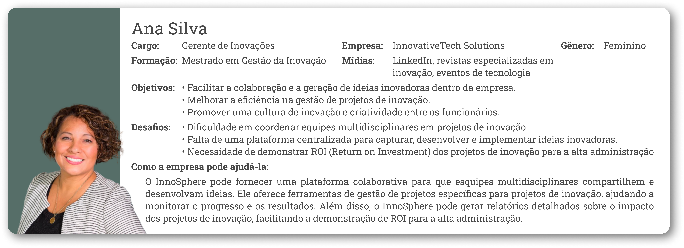
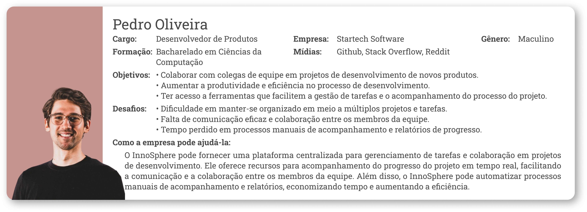
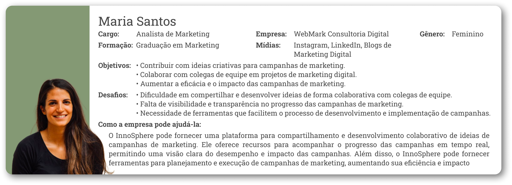
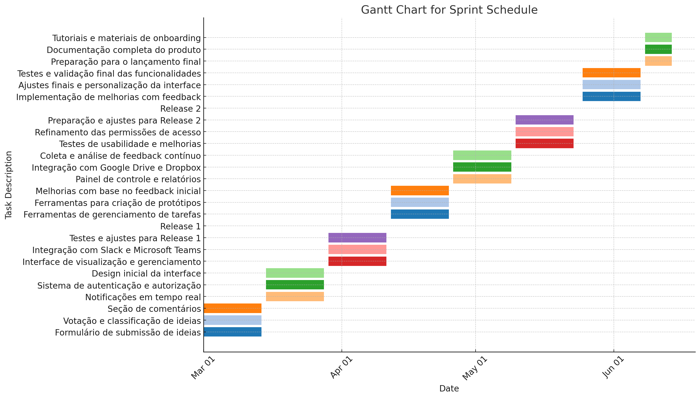

    

<h3>Sumário</h3>

[Visão do Produto](https://github.com/mvarocha/innosphere?tab=readme-ov-file#vis%C3%A3o-do-produto)  
[Principais Características e Benefícios](https://github.com/mvarocha/innosphere?tab=readme-ov-file#principais-caracter%C3%ADsticas-e-benef%C3%ADcios)  
[Project Model Canvas](https://github.com/mvarocha/innosphere?tab=readme-ov-file#project-model-canvas)  
[Personas](https://github.com/mvarocha/innosphere?tab=readme-ov-file#personas)  
[Product Backlog](https://github.com/mvarocha/innosphere?tab=readme-ov-file#product-backlog)  
[User Stories](https://github.com/mvarocha/innosphere?tab=readme-ov-file#user-stories)  
[Plano de Releases](https://github.com/mvarocha/innosphere?tab=readme-ov-file#plano-de-releases)  
[Roadmap](https://github.com/mvarocha/innosphere?tab=readme-ov-file#roadmap)  
[Simulação de Distribuição do Backlog](https://github.com/mvarocha/innosphere?tab=readme-ov-file#simula%C3%A7%C3%A3o-de-distribui%C3%A7%C3%A3o-do-backlog)  
[Plano de Custos do Projeto InnoSphere](https://github.com/mvarocha/innosphere?tab=readme-ov-file#plano-de-custos-do-projeto-innosphere)

# Visão do Produto
Nosso produto é um sistema de gestão de criatividade e inovação, projetado para equipes que buscam uma abordagem colaborativa e criativa no desenvolvimento de novas ideias e projetos. Nosso objetivo é fornecer uma plataforma que inspire a criatividade e colaboração entre os membros da equipe e promova a experimentação e inovação.

## Principais Características e Benefícios

### Brainstorming e Captura de Ideias
Ferramentas intuitivas para capturar, organizar e desenvolver ideias de forma colaborativa, permitindo que os membros da equipe contribuam com suas sugestões e insights.

### Gestão de Projetos Criativos

Funcionalidades específicas para o gerenciamento de projetos de inovação, incluindo fluxos de trabalho flexíveis, ferramentas de acompanhamento de progresso e recursos de priorização de tarefas.

### Colaboração Multidisciplinar

Suporte para equipes multidisciplinares, facilitando a colaboração entre profissionais de diferentes áreas e a integração de diferentes perspectivas no processo criativo.

### Estímulo à Experimentação

Recursos para experimentação e prototipagem rápida, permitindo que as equipes testem e refinem suas ideias de forma iterativa entes de implementá-las em escala.

### Análise e Avaliação de Ideias

Ferramentas de análise e avaliação para ajudar as equipes a identificar ideias mais promissoras e tomar decisões fundamentadas sobre quais projetos seguir em frente.

## Project Model Canvas

## Personas

[Clique aqui para ver o documento](https://github.com/mvarocha/InnoSphere/blob/main/personas/Personas%207297db1e7b134128af173608e19a9eda.md)

## Roadmap
Para ver o Roadmap detalhado [clique aqui]().

## Simulação de Distribuição do Backlog

> **Período do Projeto:** 01/03/2024 a 14/06/2024
**Número de Semanas:** 15 semanas
**Número de Sprints de 3 semanas:** 5 Sprints

Para acessar a planilha de User Story e Backlog [clique aqui]().
Para acessar a documentação detalhada de User Stories, Backlog e planejamento da Sprint, [clique aqui]().

### Cerimônias Ágeis
- **Sprint Planning:** Primeiro dia da sprint (máximo de 4 horas)
- **Daily Stand-up:** Todos os dias da sprint (15 minutos)
- **Sprint Review:** Último dia da sprint (máximo de 2 horas)
- **Sprint Retrospective:** Último dia da sprint (máximo de 1 hora)

### Sprints

- Sprint 1 (01/03/2024 - 21/03/2024)
- Sprint 2 (22/03/2024 - 11/04/2024)
- **Release 1: 12/04/2024**
- Sprint 3 (12/04/2024 - 02/05/2024)
- Sprint 4 (03/05/2024 - 23/05/2024)
- **Release 2: 24/05/2024**
- Sprint 5 (24/05/2024 - 13/06/2024)

### Resumo das Cerimônias e Cronograma
#### Sprint Planning

- **Quando:** Primeiro dia de cada sprint (01/03, 22/03, 12/04, 03/05, 24/05)
- **Duração:** Máximo de 4 horas

#### Daily Stand-up

- **Quando:** Todos os dias da sprint
- **Duração:** 15 minutos

#### Sprint Review

- **Quando:** Último dia de cada sprint (21/03, 11/04, 02/05, 23/05, 13/06)
- **Duração:** Máximo de 2 horas

#### Sprint Retrospective

- **Quando:** Último dia de cada sprint (21/03, 11/04, 02/05, 23/05, 13/06)
- **Duração:** Máximo de 1 hora

## Plano de Custos do Projeto InnoSphere
Plano de custo detalhado disponível no arquivo [Plano de Custos InnoSphere.xlsx](./Plano%20de%20Custos%20InnoSphere.xlsx)

| Item                          | Custo (R$)        |
|-------------------------------|-------------------|
| **Release 1**                 | 126.750,00        |
| **Release 2**                 | 108.750,00        |
| **Finalização**               | 54.375,00         |
| **Contingências Diversas**    | 28.987,50         |
| **Custo Total do Projeto**    | 318.862,50        |