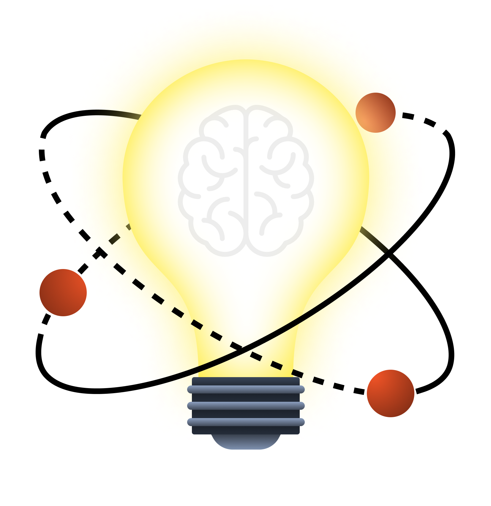

    

<h3>Sumário</h3>

[Visão do Produto](https://github.com/mvarocha/innosphere?tab=readme-ov-file#vis%C3%A3o-do-produto)  
[Principais Características e Benefícios](https://github.com/mvarocha/innosphere?tab=readme-ov-file#principais-caracter%C3%ADsticas-e-benef%C3%ADcios)  
[Project Model Canvas](https://github.com/mvarocha/innosphere?tab=readme-ov-file#project-model-canvas)  
[Personas](https://github.com/mvarocha/innosphere?tab=readme-ov-file#personas)  
[Product Backlog](https://github.com/mvarocha/innosphere?tab=readme-ov-file#product-backlog)  
[User Stories](https://github.com/mvarocha/innosphere?tab=readme-ov-file#user-stories)  
[Plano de Releases](https://github.com/mvarocha/innosphere?tab=readme-ov-file#plano-de-releases)  
[Roadmap](https://github.com/mvarocha/innosphere?tab=readme-ov-file#roadmap)  
[Simulação de Distribuição do Backlog](https://github.com/mvarocha/innosphere?tab=readme-ov-file#simula%C3%A7%C3%A3o-de-distribui%C3%A7%C3%A3o-do-backlog)  
[Plano de Custos do Projeto InnoSphere](https://github.com/mvarocha/innosphere?tab=readme-ov-file#plano-de-custos-do-projeto-innosphere)

# Visão do Produto
Nosso produto é um sistema de gestão de criatividade e inovação, projetado para equipes que buscam uma abordagem colaborativa e criativa no desenvolvimento de novas ideias e projetos. Nosso objetivo é fornecer uma plataforma que inspire a criatividade e colaboração entre os membros da equipe e promova a experimentação e inovação.

## Principais Características e Benefícios

### Brainstorming e Captura de Ideias
Ferramentas intuitivas para capturar, organizar e desenvolver ideias de forma colaborativa, permitindo que os membros da equipe contribuam com suas sugestões e insights.

### Gestão de Projetos Criativos

Funcionalidades específicas para o gerenciamento de projetos de inovação, incluindo fluxos de trabalho flexíveis, ferramentas de acompanhamento de progresso e recursos de priorização de tarefas.

### Colaboração Multidisciplinar

Suporte para equipes multidisciplinares, facilitando a colaboração entre profissionais de diferentes áreas e a integração de diferentes perspectivas no processo criativo.

### Estímulo à Experimentação

Recursos para experimentação e prototipagem rápida, permitindo que as equipes testem e refinem suas ideias de forma iterativa entes de implementá-las em escala.

### Análise e Avaliação de Ideias

Ferramentas de análise e avaliação para ajudar as equipes a identificar ideias mais promissoras e tomar decisões fundamentadas sobre quais projetos seguir em frente.

## Project Model Canvas

## Personas

[Clique aqui para ver o documento](https://github.com/mvarocha/InnoSphere/blob/main/personas/Personas%207297db1e7b134128af173608e19a9eda.md)

## Product Backlog

- Captura de Ideias
  - Usuários podem submeter ideias.
  - Ideias podem ser categorizadas por tipo e tema.
  - Sistema de tags para facilitar a busca e organização.
- Organização e Priorização de Ideias
  - Ferramentas para votação e classificação de ideias.
  - Mecanismo para priorizar ideias com base em critérios definidos (impacto, viabilidade, etc.).
  - Interface para visualização e gerenciamento das ideias priorizadas.
- Colaboração e Comunicação
  - Seção de comentários para cada ideia.
  - Notificações em tempo real para atualizações e novos comentários.
  - Integração com ferramentas de comunicação (e.g., Slack, Microsoft Teams).
- Gestão de Projetos Criativos
  - Criação de projetos a partir de ideias aprovadas.
  - Ferramentas de gerenciamento de tarefas dentro dos projetos.
  - Atribuição de responsáveis e definição de prazos.
- Painéis de Controle e Relatórios
  - Painel de controle personalizado para visualização do progresso dos projetos.
  - Relatórios de desempenho e impacto dos projetos.
  - Exportação de dados para formatos comuns (e.g., CSV, PDF).
- Prototipagem e Experimentação
  - Ferramentas para criação rápida de protótipos.
  - Espaço para documentação de experimentos e resultados.
  - Mecanismo para iteração rápida com base em feedback.
- Análise e Avaliação de Ideias
  - Ferramentas de análise de viabilidade técnica e econômica.
  - Mecanismos para avaliação de ideias por especialistas.
  - Relatórios de avaliação detalhados para tomada de decisão.
- Segurança e Permissões
  - Sistema de autenticação e autorização de usuários.
  - Definição de permissões de acesso por papel (admin, colaborador, visualizador).
  - Logs de atividades para auditoria e conformidade.
- Integrações Externas
  - Integração com ferramentas de produtividade (e.g., Google Drive, Dropbox).
  - API para integração com sistemas de terceiros.
  - Webhooks para notificações automáticas de eventos.
- Feedback dos Usuários
  - Mecanismo para coleta de feedback contínuo dos usuários.
  - Ferramentas para análise de feedback e implementação de melhorias.
  - Sistema de rastreamento de bugs e solicitações de funcionalidades.
- Interface de Usuário e Experiência (UI/UX)
  - Design responsivo para acesso em dispositivos móveis e desktop.
  - Testes de usabilidade para melhorar a experiência do usuário.
  - Personalização da interface do usuário (temas, layouts).
- Lançamento e Onboarding
  - Guia de início rápido para novos usuários.
  - Tutoriais e documentação completa do produto.
  - Processo de onboarding para equipes e empresas.

## User Stories

<mark>**User Story:**</mark>
Eu como membro da equipe, gostaria de submeter ideias para novos projetos, para que possamos explorar novas oportunidades de inovação.

<mark>**Critérios de Aceitação:**</mark>
- Deve haver um formulário para submissão de ideias.
- O formulário deve permitir a categorização por tipo e tema.
- Deve ser possível adicionar tags às ideias.

<mark>**Definition of Done:**</mark>
- Formulário de submissão de ideias implementado.
- Categorias e tags configuráveis.
- Testes realizados para garantir que ideias podem ser submetidas e categorizadas corretamente.

---

<mark>**User Story:**</mark>
Eu como gerente de inovação, gostaria de poder votar e classificar ideias para priorizar aquelas com maior potencial.

<mark>**Critérios de Aceitação:**</mark>
- Deve haver um mecanismo de votação para as ideias.
- As ideias devem poder ser classificadas com base nos votos recebidos.
- Deve haver uma interface para visualizar e gerenciar a lista de ideias priorizadas.

<mark>**Definition of Done:**</mark>
- Sistema de votação implementado.
- Interface de classificação de ideias disponível.
- Testes realizados para garantir a funcionalidade de votação e classificação.

---

<mark>**User Story:**</mark>
Eu como membro da equipe, gostaria de comentar em ideias e receber notificações em tempo real, para colaborar de forma mais eficaz.

<mark>**Critérios de Aceitação:**</mark>
- Deve haver uma seção de comentários para cada ideia.
- Notificações em tempo real devem ser enviadas para atualizações e novos comentários.
- Integração com ferramentas de comunicação como Slack ou Microsoft Teams.

<mark>**Definition of Done:**</mark>
- Seção de comentários implementada.
- Notificações em tempo real configuradas.
- Integrações com ferramentas de comunicação testadas e funcionando.

---

<mark>**User Story:**</mark>
Eu como gerente de projeto, gostaria de criar projetos a partir de ideias aprovadas e gerenciar as tarefas dentro desses projetos.

<mark>**Critérios de Aceitação:**</mark>
- Deve ser possível criar projetos a partir de ideias aprovadas.
- Deve haver ferramentas de gerenciamento de tarefas dentro dos projetos.
- Deve ser possível atribuir responsáveis e definir prazos para as tarefas.

<mark>**Definition of Done:**</mark>
- Ferramentas de criação e gerenciamento de projetos implementadas.
- Atribuição de responsáveis e definição de prazos funcional.
- Testes realizados para garantir a criação e gestão de projetos.

---

<mark>**User Story:**</mark>
Eu como executivo, gostaria de visualizar painéis de controle personalizados e gerar relatórios de desempenho dos projetos.

<mark>**Critérios de Aceitação:**</mark>
- Deve haver painéis de controle personalizáveis.
- Relatórios de desempenho devem ser gerados automaticamente.
- Os dados devem poder ser exportados em formatos comuns como CSV e PDF.

<mark>**Definition of Done:**</mark>
- Painéis de controle personalizáveis implementados.
- Relatórios de desempenho funcionando corretamente.
- Exportação de dados testada e funcionando.

---

<mark>**User Story:**</mark>
Eu como desenvolvedor de produtos, gostaria de ter ferramentas para criar protótipos rapidamente e documentar experimentos.

<mark>**Critérios de Aceitação:**</mark>
- Deve haver ferramentas para criação rápida de protótipos.
- Deve haver um espaço para documentação de experimentos e resultados.
- Deve ser possível iterar rapidamente com base no feedback.

<mark>**Definition of Done:**</mark>
- Ferramentas de prototipagem implementadas.
- Documentação de experimentos funcional.
- Testes realizados para garantir a iteração rápida.

---

<mark>**User Story:**</mark>
Eu como especialista em inovação, gostaria de ferramentas para analisar e avaliar a viabilidade técnica e econômica das ideias.

<mark>**Critérios de Aceitação:**</mark>
- Deve haver ferramentas de análise de viabilidade técnica e econômica.
- Deve haver mecanismos para avaliação de ideias por especialistas.
- Relatórios de avaliação detalhados devem estar disponíveis.

<mark>**Definition of Done:**</mark>
- Ferramentas de análise e avaliação implementadas.
- Relatórios de avaliação detalhados funcionais.
- Testes realizados para garantir a precisão das análises.

---

<mark>**User Story:**</mark>
Eu como administrador do sistema, gostaria de definir permissões de acesso para diferentes usuários e garantir a segurança dos dados.

<mark>**Critérios de Aceitação:**</mark>
- Deve haver um sistema de autenticação e autorização de usuários.
- Permissões de acesso devem ser configuráveis por papel (admin, colaborador, visualizador).
- Logs de atividades devem estar disponíveis para auditoria.

<mark>**Definition of Done:**</mark>
- Sistema de autenticação e autorização implementado.
- Configuração de permissões funcional.
- Logs de atividades funcionando e acessíveis.

---

<mark>**User Story:**</mark>
Eu como gerente de TI, gostaria de integrar o InnoSphere com outras ferramentas de produtividade que já usamos.

<mark>**Critérios de Aceitação:**</mark>
- Deve haver integração com ferramentas de produtividade como Google Drive e Dropbox.
- Deve haver uma API para integração com sistemas de terceiros.
- Webhooks para notificações automáticas de eventos devem estar disponíveis.

<mark>**Definition of Done:**</mark>
- Integrações com ferramentas de produtividade implementadas.
- API funcional e documentada.
- Webhooks configurados e testados.

---

<mark>**User Story:**</mark>
Eu como usuário, gostaria de fornecer feedback contínuo sobre o produto para que melhorias possam ser feitas.

<mark>**Critérios de Aceitação:**</mark>
- Deve haver um mecanismo para coleta de feedback dos usuários.
- Ferramentas para análise de feedback e implementação de melhorias devem estar disponíveis.
- Sistema de rastreamento de bugs e solicitações de funcionalidades deve estar acessível.

<mark>**Definition of Done:**</mark>
- Mecanismo de coleta de feedback implementado.
- Ferramentas de análise e rastreamento de bugs funcionais.
- Testes realizados para garantir a coleta e análise de feedback.

---

<mark>**User Story:**</mark>
Eu como designer de UX, gostaria de garantir que a interface do usuário seja responsiva e intuitiva para todos os dispositivos.

<mark>**Critérios de Aceitação:**</mark>
- A interface deve ser responsiva para dispositivos móveis e desktop.
- Devem ser realizados testes de usabilidade para melhorar a experiência do usuário.
- Personalização da interface do usuário (temas, layouts) deve estar disponível.

<mark>**Definition of Done:**</mark>
- Interface responsiva implementada.
- Testes de usabilidade realizados e melhorias aplicadas.
- Personalização da interface funcional.

---

<mark>**User Story:**</mark>
Eu como novo usuário, gostaria de ter acesso a tutoriais e documentação completa para começar a usar o InnoSphere rapidamente.

<mark>**Critérios de Aceitação:**</mark>
- Deve haver um guia de início rápido para novos usuários.
- Tutoriais e documentação completa do produto devem estar disponíveis.
- Processo de onboarding para equipes e empresas deve ser claro e acessível.

<mark>**Definition of Done:**</mark>
- Guia de início rápido implementado.
- Tutoriais e documentação completos e acessíveis.
- Processo de onboarding testado e funcional.

## Plano de Releases

### Release 1: Início da Plataforma e Funcionalidades Básicas

<mark>**Data de lançamento:**</mark>
12/04/2024

<mark>**Objetivos**</mark>
- Estabelecer a base da plataforma com funcionalidades essenciais.
- Permitir a captura, organização e priorização de ideias.
- Facilitar a colaboração inicial e comunicação entre os usuários.

<mark>**Principais Funcionalidades**</mark>
- Captura de Ideias
- Organização e Priorização de Ideias
- Colaboração e Comunicação (seção de comentários e notificações em tempo real)
- Segurança e Permissões (sistema de autenticação e autorização básico)

<mark>**Critérios de Sucesso**</mark>
- Usuários conseguem submeter, categorizar e priorizar ideias.
- Funcionalidade de comentários e notificações em tempo real funcionando.
- Sistema de autenticação e autorização básico implementado.

### Release 2: Expansão de Funcionalidades e Gestão de Projetos

<mark>**Data de lançamento:**</mark>
24/05/2024

<mark>**Objetivos**</mark>
- Adicionar funcionalidades avançadas de gestão de projetos e prototipagem.
- Integrar ferramentas externas e melhorar a experiência do usuário.
- Implementar painéis de controle e relatórios para acompanhamento de projetos.

<mark>**Principais Funcionalidades**</mark>
- Gestão de Projetos Criativos
- Prototipagem e Experimentação
- Painéis de Controle e Relatórios
- Integrações Externas (Google Drive, Dropbox)
- Interface de Usuário e Experiência (UI/UX) responsiva

<mark>**Critérios de Sucesso**</mark>
- Gestão de projetos e tarefas dentro da plataforma.
- Ferramentas de prototipagem e experimentação disponíveis.
- Painéis de controle e relatórios funcionando corretamente.
- Integrações externas funcionando.
- Interface responsiva e testes de usabilidade concluídos.

## Roadmap

### Sprint 1 (01/03/2024 - 14/03/2024)

- Captura de Ideias: Formulário de submissão de ideias com categorias e tags.
- Organização e Priorização de Ideias: Implementação inicial de votação e classificação.
- Colaboração e Comunicação: Seção de comentários.

### Sprint 2 (15/03/2024 - 28/03/2024)

- Colaboração e Comunicação: Notificações em tempo real.
- Segurança e Permissões: Sistema de autenticação e autorização básico.
- Interface de Usuário: Design inicial da interface.

### Sprint 3 (29/03/2024 - 11/04/2024)

- Organização e Priorização de Ideias: Interface de visualização e gerenciamento.
- Colaboração e Comunicação: Integração com Slack e Microsoft Teams.
- Testes e ajustes para Release 1.

### Release 1: 12/04/2024

### Sprint 4 (12/04/2024 - 25/04/2024)

- Gestão de Projetos Criativos: Ferramentas de gerenciamento de tarefas e criação de projetos.
- Prototipagem e Experimentação: Ferramentas para criação de protótipos.
- Interface de Usuário: Melhorias com base no feedback inicial.
### Sprint 5 (26/04/2024 - 09/05/2024)

- Painéis de Controle e Relatórios: Painel de controle personalizado e relatórios de desempenho.
- Integrações Externas: Integração com Google Drive e Dropbox.
- Feedback dos Usuários: Coleta e análise de feedback contínuo.

### Sprint 6 (10/05/2024 - 23/05/2024)

- Interface de Usuário e Experiência: Testes de usabilidade e melhorias.
- Segurança e Permissões: Refinamento das permissões de acesso.
- Preparação e ajustes para Release 2.

### Release 2: 24/05/2024

### Sprint 7 (25/05/2024 - 07/06/2024)

- Feedback dos Usuários: Implementação de melhorias com base no feedback.
- Interface de Usuário: Ajustes finais e personalização da interface.
- Testes e validação final das funcionalidades.

### Sprint 8 (08/06/2024 - 14/06/2024)

- Preparação para o lançamento final.
- Documentação completa do produto.
- Tutoriais e materiais de onboarding.

> **OBSERVAÇÕES** 
**Releases Incrementais:** Cada release inclui funcionalidades essenciais que oferecem valor aos usuários e permitem feedback contínuo para melhorias. 
**Feedback e Ajustes:** Feedback dos usuários será coletado continuamente após cada release para implementar melhorias. 
**Documentação e Onboarding:** A documentação e o processo de onboarding serão preparados e refinados ao longo do desenvolvimento para garantir uma boa experiência aos novos usuários.

## Simulação de Distribuição do Backlog

> **Período do Projeto:** 01/03/2024 a 14/06/2024
**Número de Semanas:** 15 semanas
**Número de Sprints de 3 semanas:** 5 Sprints

### Cerimônias Ágeis
- **Sprint Planning:** Primeiro dia da sprint (máximo de 4 horas)
- **Daily Stand-up:** Todos os dias da sprint (15 minutos)
- **Sprint Review:** Último dia da sprint (máximo de 2 horas)
- **Sprint Retrospective:** Último dia da sprint (máximo de 1 hora)

### Distribuição de Sprint e Cronograma de Cerimônias

#### Sprint 1 (01/03/2024 - 21/03/2024)

- **Sprint Planning:** 01/03/2024
- **Daily Stand-up:** Todos os dias
- **Sprint Review:** 21/03/2024
- **Sprint Retrospective:** 21/03/2024
- **Backlog Items:**
  - Captura de Ideias (formulário de submissão, categorização, tags)
  - Organização e Priorização de Ideias (votação e classificação inicial)
  - Colaboração e Comunicação (seção de comentários)
  - Segurança e Permissões (sistema de autenticação e autorização básico)

### Sprint 2 (22/03/2024 - 11/04/2024)

- **Sprint Planning:** 22/03/2024
- **Daily Stand-up:** Todos os dias
- **Sprint Review:** 11/04/2024
- **Sprint Retrospective:** 11/04/2024
- **Backlog Items:**
  - Colaboração e Comunicação (notificações em tempo real)
  - Organização e Priorização de Ideias (interface de visualização e gerenciamento)
  - Interface de Usuário (design inicial)
  - Testes e ajustes para Release 1

### Release 1: 12/04/2024

### Sprint 3 (12/04/2024 - 02/05/2024)

- **Sprint Planning:** 12/04/2024
- **Daily Stand-up:** Todos os dias
- **Sprint Review:** 02/05/2024
- **Sprint Retrospective:** 02/05/2024
- **Backlog Items:**
  - Gestão de Projetos Criativos (ferramentas de gerenciamento de tarefas e criação de projetos)
  - Prototipagem e Experimentação (ferramentas para criação de protótipos)
  - Interface de Usuário (melhorias com base no feedback inicial)

### Sprint 4 (03/05/2024 - 23/05/2024)

- **Sprint Planning:** 03/05/2024
- **Daily Stand-up:** Todos os dias
- **Sprint Review:** 23/05/2024
- **Sprint Retrospective:** 23/05/2024
- **Backlog Items:**
  - Painéis de Controle e Relatórios (painel de controle personalizado e relatórios de desempenho)
  - Integrações Externas (integração com Google Drive e Dropbox)
  - Feedback dos Usuários (coleta e análise de feedback contínuo)
  - Interface de Usuário e Experiência (testes de usabilidade e melhorias)
  - Preparação e ajustes para Release 2

### Release 2: 24/05/2024

### Sprint 5 (24/05/2024 - 13/06/2024)

- **Sprint Planning:** 24/05/2024
- **Daily Stand-up:** Todos os dias
- **Sprint Review:** 13/06/2024
- **Sprint Retrospective:** 13/06/2024
- **Backlog Items:**
  - Feedback dos Usuários (implementação de melhorias com base no feedback)
  - Interface de Usuário (ajustes finais e personalização)
  - Testes e validação final das funcionalidades
  - Preparação para o lançamento final
  - Documentação completa do produto
  - Tutoriais e materiais de onboarding

### Resumo das Cerimônias e Cronograma
#### Sprint Planning

- **When:** Primeiro dia de cada sprint (01/03, 22/03, 12/04, 03/05, 24/05)
- **Duration:** Máximo de 4 horas

#### Daily Stand-up

- **When:** Todos os dias da sprint
- **Duration:** 15 minutos

#### Sprint Review

- **When:** Último dia de cada sprint (21/03, 11/04, 02/05, 23/05, 13/06)
- **Duration:** Máximo de 2 horas

#### Sprint Retrospective

- **When:** Último dia de cada sprint (21/03, 11/04, 02/05, 23/05, 13/06)
- **Duration:** Máximo de 1 hora

## Plano de Custos do Projeto InnoSphere

**Período do Projeto:** 01/03/2024 a 14/06/2024  
**Número de Releases:** 2 (12/04/2024 e 24/05/2024)

#### Premissas e Hipóteses

1. **Equipe de Desenvolvimento:**
   - 5 desenvolvedores
   - 1 líder de projeto (acumulando papéis de PO e SM)

2. **Custo da Mão de Obra:**
   - Desenvolvedor: R$ 10.000,00/mês
   - Líder de Projeto: R$ 15.000,00/mês

3. **Ferramentas e Softwares:**
   - Licenças de software de desenvolvimento (IDE, ferramentas de design, etc.): R$ 5.000,00
   - Serviços de hospedagem e infraestrutura na nuvem: R$ 1.500,00/mês
   - Ferramentas de comunicação e colaboração (Slack, Trello, etc.): R$ 1.000,00/mês

4. **Despesas Operacionais:**
   - Custos de escritório (aluguel, internet, eletricidade, etc.): R$ 3.000,00/mês

5. **Marketing e Divulgação:**
   - Custo inicial para pesquisa de mercado e estratégias de marketing: R$ 8.000,00
   - Custo contínuo de marketing e publicidade: R$ 2.000,00/mês

6. **Testes e Garantia de Qualidade:**
   - Ferramentas de teste automatizado e QA: R$ 3.000,00

7. **Capacitação e Treinamento:**
   - Cursos e workshops para a equipe: R$ 2.000,00

8. **Outros Custos:**
   - Contingências diversas (10% do custo total estimado)

### Cálculo de Custos

#### Custos Mensais Fixos
- **Desenvolvedores (5):** R$ 10.000,00 * 5 = R$ 50.000,00
- **Líder de Projeto:** R$ 15.000,00
- **Infraestrutura e Ferramentas:**
  - Hospedagem e infraestrutura: R$ 1.500,00
  - Ferramentas de comunicação: R$ 1.000,00
- **Despesas Operacionais:** R$ 3.000,00
- **Marketing e Divulgação:** R$ 2.000,00

**Total Mensal Fixo:** R$ 50.000,00 + R$ 15.000,00 + R$ 1.500,00 + R$ 1.000,00 + R$ 3.000,00 + R$ 2.000,00 = R$ 72.500,00

#### Custos Únicos
- **Ferramentas e Software (licenças):** R$ 5.000,00
- **Pesquisa de Mercado e Estratégias de Marketing:** R$ 8.000,00
- **Ferramentas de Teste Automatizado e QA:** R$ 3.000,00
- **Capacitação e Treinamento:** R$ 2.000,00

**Total Único:** R$ 5.000,00 + R$ 8.000,00 + R$ 3.000,00 + R$ 2.000,00 = R$ 18.000,00

### Plano de Custos por Release

**Período do Projeto:** 15 semanas

- **Total de Meses:** 3 meses + 3 semanas
  - Meses completos: Março, Abril, Maio
  - Semanas adicionais: 2 semanas de Junho (aproximadamente meio mês)

#### Custo por Release

**Release 1 (12/04/2024):**
- **Período:** 01/03/2024 a 12/04/2024
- **Duração:** 6 semanas (1.5 meses)
- **Custo Fixo Mensal:** R$ 72.500,00 * 1.5 = R$ 108.750,00
- **Custo Único:** R$ 18.000,00 (todo o custo único é aplicado no início do projeto)

**Total Release 1:** R$ 108.750,00 + R$ 18.000,00 = R$ 126.750,00

**Release 2 (24/05/2024):**
- **Período:** 13/04/2024 a 24/05/2024
- **Duração:** 6 semanas (1.5 meses)
- **Custo Fixo Mensal:** R$ 72.500,00 * 1.5 = R$ 108.750,00

**Total Release 2:** R$ 108.750,00

**Finalização do Projeto (25/05/2024 a 14/06/2024):**
- **Duração:** 3 semanas (0.75 meses)
- **Custo Fixo Mensal:** R$ 72.500,00 * 0.75 = R$ 54.375,00

**Total Finalização:** R$ 54.375,00

### Resumo dos Custos

1. **Release 1:** R$ 126.750,00
2. **Release 2:** R$ 108.750,00
3. **Finalização:** R$ 54.375,00
4. **Contingências Diversas (10% do Total):** (R$ 126.750,00 + R$ 108.750,00 + R$ 54.375,00) * 0.10 = R$ 28.987,50

**Custo Total do Projeto:** R$ 126.750,00 + R$ 108.750,00 + R$ 54.375,00 + R$ 28.987,50 = R$ 318.862,50

---

### Plano de Custos do Projeto InnoSphere

| Item                          | Custo (R$)        |
|-------------------------------|-------------------|
| **Release 1**                 | 126.750,00        |
| **Release 2**                 | 108.750,00        |
| **Finalização**               | 54.375,00         |
| **Contingências Diversas**    | 28.987,50         |
| **Custo Total do Projeto**    | 318.862,50        |